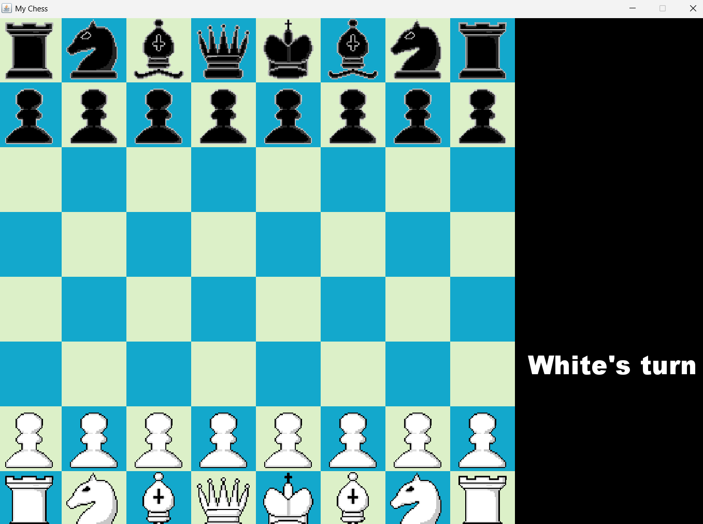
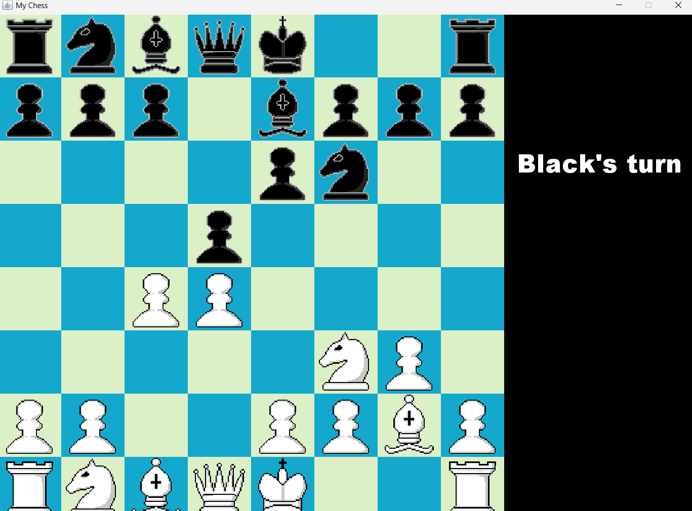

# Java Chess Game 

A fully functional chess game written in Java with a custom move validation engine and graphical interface.  
The project implements the complete rules of chess without relying on external game engines or libraries.

The goal of this project was to explore game logic, object-oriented design, and algorithmic problem solving by implementing chess rules from scratch.

---

## Screenshots

### Default position when game starts:

### Catalan position:

## Run for Windows

.\run.bat

### Run (Mac/Linux)

./run.sh

## Features

### Full Chess Rules Implemented
- Legal movement validation for all pieces
- Check detection
- Checkmate detection
- Castling
- En passant
- Pawn promotion

### Game Logic
- Piece movement validation prevents illegal moves
- Pieces cannot move through other pieces where applicable
- Checkmate detection evaluates whether a check can be:
  - blocked
  - captured
  - escaped by the king

### Graphical Interface
- Interactive board rendering
- Piece movement through user interaction
- Visual updates handled through the game loop
- Music determined by the game state (check vs non-check)

---

## Architecture

The project follows an object-oriented design where each chess piece contains its own movement logic and inherit from a base Piece class.

### Core Components

#### GamePanel
Central class responsible for:

- Game loop
- Rendering the board and pieces
- Tracking game state
- Moving the pieces

#### Piece Classes

Each piece is implemented as its own class:

- Pawn
- Rook
- Knight
- Bishop
- Queen
- King

Each class contains logic that determines whether a move is valid for that piece.

Example:
- The Queen combines the movement logic of both the rook and bishop.

#### Board Representation

The board is represented using coordinate positions where pieces track their:

- current row
- current column

Movement validation checks paths between squares to prevent pieces from passing through others.

---

## Check Detection

When a king is in check, the engine determines the direction of the attacking piece and determines the path between the attacker and the king.

---

## Checkmate Detection

Checkmate is determined using the following process:

1. Detect that the king is currently in check
2. Identify the path of the attacking piece
3. Determine whether any friendly piece can:
   - capture the attacking piece
   - block the attack path
4. Check if the king can move to any safe square

For performance reasons, the king's possible escape moves are evaluated first before checking blocking possibilities.

If none of these options exist, the position is declared checkmate.

---

## Special Rules

### Castling
Castling is allowed only when:

- Neither the king nor rook has moved
- The squares between them are empty
- The king does not pass through check

### En Passant
En passant is implemented using a last moved piece reference stored in the game state.  
This allows the engine to detect when a pawn has moved two squares and is vulnerable to en passant capture on the following move.

### Pawn Promotion
When a pawn reaches the final rank, it can be promoted to another piece.

### Stalemate
Stalemate occurs when a player has no legal moves and are currently not in check. And the 50 move rule is implemented, if no pieces have been captured in 50 moves the game ends due to a stalemate.

---

## Technologies Used

- Java
- Java Swing / AWT for rendering and UI
- Object-Oriented Programming principles
